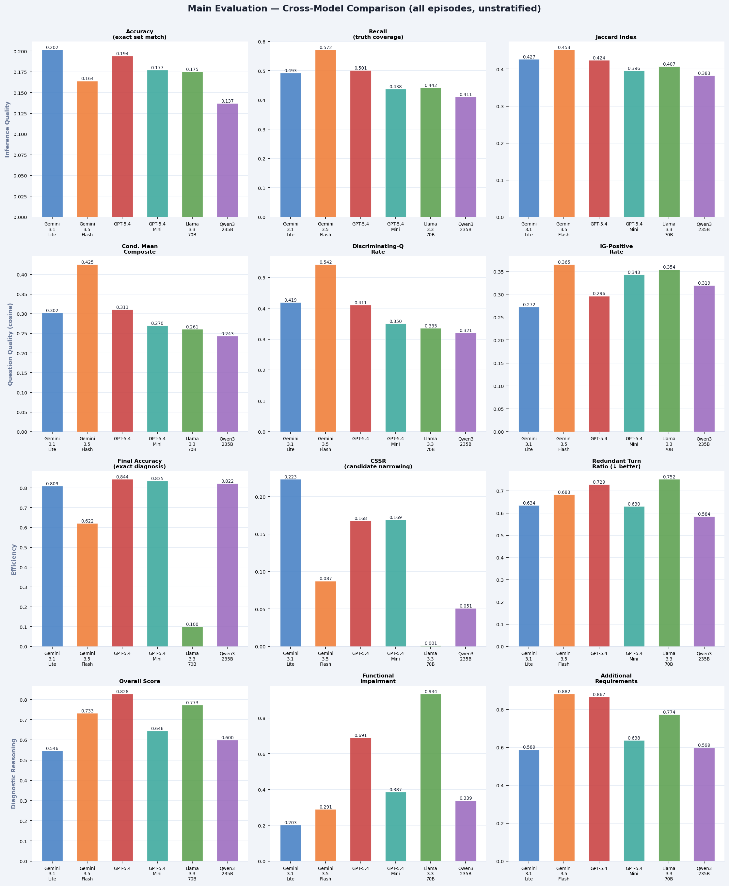
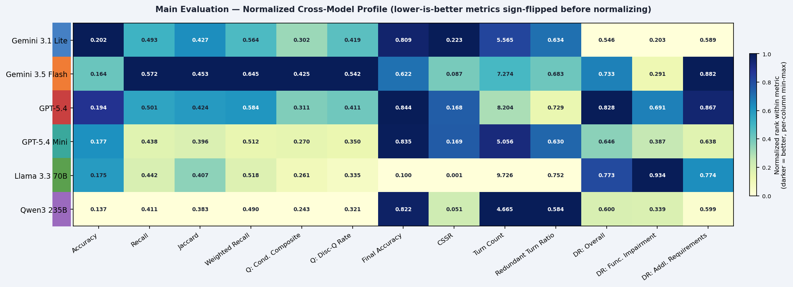

# Main Evaluation — 모델 간 비교 분석 보고서

**Judge 모델:** `gemini-3.5-flash` (의사 / 추론 평가 모델)
**범위:** 로그에 기록된 전체 에피소드 — 결과(정답/오답)에 따른 층화를 **적용하지 않음** (동일 지표를 정답/오답으로 나눈 분석은 [`outcome_stratified/ablation_findings.md`](outcome_stratified/ablation_findings.md) 참고)
**집계 방식:** 모델별 macro-mean (에피소드 가중), spec §4.4.7 기준 — 추론 품질은 턴 단위 값을 에피소드 평균으로 롤업한 뒤 다시 모델 평균; 효율성/질문 품질/진단 추론은 에피소드 단위 기록을 직접 평균

---

## 에피소드 커버리지

| 모델 | 추론 품질 (turn_eval) | 질문 품질 | 효율성 | 진단 추론 |
|------|------------------------|-----------|--------|-----------|
| Gemini 3.1 Flash-Lite | 199 | 230 | 230 | 230 (유효 222) |
| Gemini 3.5 Flash | 120 | 230 | 230 | 213 (유효 212) |
| GPT-5.4 | 169 | 221 | 230 | 230 (유효 219) |
| GPT-5.4 Mini | 202 | 230 | 230 | 230 (유효 222) |
| Llama 3.3 70B | 68 | 230 | 230 | 221 (유효 217) |
| Qwen3-235B | 200 | 230 | 230 | 230 (유효 226) |

**⚠ 커버리지 주의사항:** 추론 품질 표본 수는 모델별로 크게 다름 (68~202개), 반면 나머지 세 차원은 거의 대부분 230개에 근접함. Gemini 3.5 Flash(120개)와 특히 Llama 3.3 70B(68개)는 효율성/DR/질문 평가(각 230/221개)에 비해 `turn_eval.json` 행의 상당 부분이 누락되어 있으며, 이는 턴 로그 미완성 또는 파싱 실패에 기인한 것으로 보임. 로그 커버리지가 보완되기 전까지 이 두 모델의 추론 품질 순위는 네 차원 중 가장 노이즈가 큰 것으로 간주할 것.

---

## 시각화 개요

히트맵은 6개 모델에 대해 각 지표 열을 min-max 정규화한 것으로 (해당 열 기준 진하게 표시될수록 우수), 정확도(0~1)와 턴 수(4~10)처럼 스케일이 크게 다른 지표들을 모델별 프로파일로 한눈에 훑어볼 수 있도록 함. 각 셀에는 원래 값이 표기되며, 낮을수록 좋은 지표(턴 수, 중복 턴 비율)는 정규화 전 부호를 반전시켰으나 셀 텍스트에는 실제 값을 표시함.

---

## 1. 추론 품질 (Inference Quality)

**데이터 소스:** `analysis/.../turn_eval.json` — 턴별 행, 에피소드 내 턴에 대한 macro-mean, 이후 모델 내 에피소드에 대한 macro-mean.

| 모델 | 정확도 | 재현율 | 정밀도 | Jaccard | 가중 재현율 |
|------|--------|--------|--------|---------|--------------|
| Gemini 3.1 Lite | **0.202** | 0.493 | 0.780 | 0.427 | 0.564 |
| Gemini 3.5 Flash | 0.164 | **0.572** | 0.787 | **0.453** | **0.645** |
| GPT-5.4 | 0.194 | 0.501 | 0.761 | 0.424 | 0.584 |
| GPT-5.4 Mini | 0.177 | 0.438 | 0.815 | 0.396 | 0.512 |
| Llama 3.3 70B | 0.175 | 0.442 | 0.850 | 0.407 | 0.518 |
| Qwen3-235B | 0.137 | 0.411 | **0.866** | 0.383 | 0.490 |

**패턴:** 두 가지 뚜렷한 전략이 관찰됨. **Gemini 3.5 Flash**는 정확한 집합 일치(exact-match) 대신 포괄성을 택함 — 정확도는 가장 낮지만(0.164) 재현율(0.572), Jaccard(0.453), 가중 재현율(0.645)은 가장 높음. 이는 정답 질환을 더 오래, 더 넓은 후보 집합에 유지하는 전략과 일치함. **Qwen3-235B**는 그 반대의 양상을 보임 — 정밀도는 가장 높지만(0.866) 정확도(0.137), 재현율(0.411), Jaccard(0.383)는 가장 낮음: 좁고 보수적인 후보 집합을 유지하지만 배제한 항목이 틀린 경우가 많음. **Gemini 3.1 Flash-Lite**는 재현율/정밀도가 특별히 두드러지지 않음에도 정확한 집합 일치 정확도가 가장 높은데(0.202), 이는 후보 집합 자체가 더 작아 정확히 일치시키기 쉬운 구조임을 시사함.

---

## 2. 질문 품질 (Question Quality)

**데이터 소스:** `results/.../question_eval.json` — 에피소드 단위 `episode_metrics` (active-turn 조건부, macro-mean), 두 매퍼(cosine, llm_judge) 모두 보고.

### 2.1 조건부 평균 종합 점수 (Conditional Mean Composite Score)

| 모델 | cosine | llm_judge |
|------|--------|-----------|
| Gemini 3.1 Lite | 0.302 | 0.464 |
| **Gemini 3.5 Flash** | **0.425** | **0.567** |
| GPT-5.4 | 0.311 | 0.449 |
| GPT-5.4 Mini | 0.270 | 0.379 |
| Llama 3.3 70B | 0.261 | 0.329 |
| Qwen3-235B | 0.243 | 0.367 |

### 2.2 변별 질문 비율 (Discriminating-Q Rate)

| 모델 | cosine | llm_judge |
|------|--------|-----------|
| Gemini 3.1 Lite | 0.419 | 0.489 |
| **Gemini 3.5 Flash** | **0.542** | **0.604** |
| GPT-5.4 | 0.411 | 0.494 |
| GPT-5.4 Mini | 0.350 | 0.396 |
| Llama 3.3 70B | 0.335 | 0.379 |
| Qwen3-235B | 0.321 | 0.377 |

### 2.3 IG-양수 비율 (IG-Positive Rate)

| 모델 | cosine | llm_judge |
|------|--------|-----------|
| Gemini 3.1 Lite | 0.272 | 0.538 |
| **Gemini 3.5 Flash** | **0.365** | 0.460 |
| GPT-5.4 | 0.296 | 0.408 |
| GPT-5.4 Mini | 0.343 | 0.432 |
| Llama 3.3 70B | 0.354 | 0.371 |
| Qwen3-235B | 0.319 | 0.385 |

### 2.4 조건부 평균 IG (Conditional Mean IG)

| 모델 | cosine | llm_judge |
|------|--------|-----------|
| Gemini 3.1 Lite | −0.480 | 0.081 |
| **Gemini 3.5 Flash** | **−0.237** | 0.019 |
| GPT-5.4 | −0.250 | 0.050 |
| GPT-5.4 Mini | −0.284 | 0.084 |
| Llama 3.3 70B | −0.300 | 0.043 |
| Qwen3-235B | −0.320 | 0.008 |

**패턴:** **Gemini 3.5 Flash가 질문 품질에서 명확한 1위**를 차지하며, 두 매퍼 모두에서 종합 점수, 변별 질문 비율, cosine IG-양수 비율에서 1위를 기록함 — 추론 측면에서 관찰된 "넓게 탐색 후 결정" 전략과 일치함. **Qwen3-235B와 Llama 3.3 70B는 두 매퍼의 종합 점수·변별 질문 비율에서 모두 하위권에 몰림**, 추론 측면에서의 좁고 낮은 재현율의 후보 추적 패턴과 일치함. **Gemini 3.1 Flash-Lite**는 종합/변별 질문 점수는 중위권임에도 cosine 조건부 평균 IG가 가장 음수 값이 큼(−0.480) — 이 모델의 질문은 경쟁 모델들에 비해 유난히 자주 후보 집합을 확장시킴 (§3에서 확인되는 가장 높은 CSSR과는 상반되는 양상으로, 확장적 질문 이후 급격한 최종 narrowing이 일어나는 것으로 보이며 추가 조사가 필요함).

---

## 3. 효율성 (Efficiency)

**데이터 소스:** `results/.../efficiency_eval.json` — 에피소드 단위 기록.

| 모델 | 최종 정확도 | 턴 수 | CSSR | T-first | 단조성 위반 | 중복 턴 비율 | 과잉 확신 턴 |
|------|-------------|-------|------|---------|--------------|---------------|---------------|
| Gemini 3.1 Lite | 0.809 | 5.57 | **0.223** | 5.52 | 0.483 | 0.634 | 1.09 |
| Gemini 3.5 Flash | 0.622 | 7.27 | 0.087 | 7.00 | 0.652 | 0.683 | 1.93 |
| GPT-5.4 | **0.844** | 8.20 | 0.168 | 7.07 | 0.570 | 0.729 | 2.36 |
| GPT-5.4 Mini | 0.835 | 5.06 | 0.169 | 5.10 | 0.470 | 0.630 | 0.82 |
| Llama 3.3 70B | 0.100 | 9.73 | 0.001 | 8.11 | 0.952 | 0.752 | 2.57 |
| Qwen3-235B | 0.822 | **4.67** | 0.051 | **4.80** | 0.522 | **0.584** | **0.77** |

**패턴:** **Qwen3-235B가 전반적으로 가장 효율적인 모델**임 — 가장 짧은 에피소드(4.67턴), 가장 빠른 첫 정답 narrowing(4.80), 가장 낮은 중복 턴 비율(0.584), 가장 낮은 과잉 확신(0.77) — 그러면서도 최종 정확도는 높은 수준(0.822)을 유지함. **GPT-5.4 Mini**는 효율성에서 근소하게 2위이며 최종 정확도는 오히려 소폭 더 높음(0.835 vs 0.822). **GPT-5.4**는 최종 정확도 단일 최고치(0.844)를 달성하지만, 이를 위해 Qwen3의 거의 두 배에 달하는 턴 수(8.20)를 소요하며 과잉 확신 턴도 가장 많음(2.36턴, 후보 집합이 이미 하나로 좁혀진 후에도 지속되는 턴 수).

**⚠ Llama 3.3 70B는 심각한 이상치임**: 추론 측면(§1)에서는 준수한 재현율/Jaccard를 보이지만 최종 정확도는 **0.100**에 불과함 — "추적은 하지만 결정을 내리지 못하는" 실패 유형. CSSR이 자릿수 단위로 가장 낮고(0.001, 즉 후보 집합을 거의 좁히지 않음), 단조성 위반이 가장 높으며(0.952 — 후보 집합이 거의 매 턴 다시 확장됨), 에피소드가 가장 길고(9.73턴), 과잉 확신도 가장 높음(2.57). 이 모델은 이미 후보 중 정답 질환을 파악했을 가능성이 높음에도, 최종 답으로 수렴하지 않고 계속 탐색을 이어가는 것으로 보임.

**집계 방식에 대한 참고:** 위 수치는 결과와 무관하게 전체 에피소드를 풀링한 평균임. 결과 층화 절제 연구(`outcome_stratified/ablation_findings.md`)에 따르면 CSSR과 턴 수는 특히 모든 모델에서 정답/오답 에피소드 간에 극적으로 다름 — 예를 들어 Gemini 3.5 Flash의 풀링된 CSSR 0.087은 대략 정답 −0.075와 오답 +0.344의 평균으로, 에피소드별로 안정적인 값이 아님. 전반적인 순위 비교에는 이 문서의 풀링된 수치를, 특정 모델이 왜 그런 결과를 보이는지에 대한 진단에는 절제 연구 보고서를 활용할 것.

---

## 4. 진단 추론 (Diagnostic Reasoning)

**데이터 소스:** `results/.../diagnostic_reasoning_eval.json` — 에피소드 단위 LLM judge 점수.

| 모델 | 종합 | 기간 | 기능적 손상 | 외상성 스트레스 요인 | 심리사회적 스트레스 요인 | 추가 요건 |
|------|------|------|--------------|--------------------------|----------------------------|-----------|
| Gemini 3.1 Lite | 0.546 | 0.656 | 0.203 | 0.706 | 0.900 | 0.589 |
| Gemini 3.5 Flash | 0.733 | 0.852 | 0.291 | 0.895 | 1.000 | 0.883 |
| **GPT-5.4** | **0.828** | 0.937 | 0.691 | 0.850 | 1.000 | 0.867 |
| GPT-5.4 Mini | 0.646 | 0.744 | 0.387 | 0.800 | 1.000 | 0.638 |
| Llama 3.3 70B | 0.773 | 0.937 | **0.934** | 0.813 | 0.900 | 0.774 |
| Qwen3-235B | 0.600 | 0.765 | 0.339 | **0.950** | 1.000 | 0.599 |

**패턴:** **GPT-5.4가 진단 추론 종합 점수 최고치**(0.828)를 기록하며, 기간 점수(0.937)와 Llama를 제외한 모델 중 압도적으로 높은 기능적 손상 커버리지(0.691)가 이를 견인함. 이 모델은 Llama와 함께 `has_structured_checklist` 출력을 사용하는 유일한 모델(230개 중 230개 에피소드)로, 이것이 항목별 커버리지에 도움이 되었을 가능성이 있음. **Llama 3.3 70B**는 종합 점수에서 근소한 2위(0.773)이며 기능적 손상에서는 단독 1위(0.934) — DSM-5 문서화는 철저하지만, (§3 참고) 문서화한 진단을 거의 최종적으로 확정하지 않음. **Gemini 3.1 Flash-Lite**는 종합 점수(0.546)와 기능적 손상(0.203) 모두 가장 낮으며, 이는 §3에서 가장 공격적인 후보 narrowing을 보인 것과 같은 모델임 — 추론 기록이 다른 모델들에 비해 더 간결하고 항목 커버리지가 부족한 것으로 보임.

---

## 5. 차원 간 모델별 특성 분석

**GPT-5.4 — 가장 높은 상한선, 가장 높은 비용**
최종 진단 정확도(0.844)와 진단 추론 종합 점수(0.828) 모두 최고치이며, 추론 재현율(0.501, 2위)과 질문 품질(cosine 종합 점수 2위)도 준수함. 그 대가로 에피소드 길이가 두 번째로 길고(8.20턴), Llama를 제외한 모델 중 과잉 확신이 가장 높음(2.36턴, 후보를 하나로 좁힌 뒤에도 계속 진행) — 사실상 결정을 내린 뒤에도 대화를 계속 이어가는 경향.

**Gemini 3.5 Flash — 가장 넓은 탐색, 가장 약한 결단력**
추론 재현율(0.572), Jaccard(0.453), 두 매퍼 모두에서 질문 품질(종합, 변별 질문) 1위. 그러나 이러한 폭넓은 탐색 전략은 최종 정확도(0.622, 두 번째로 낮음)와 CSSR(0.087, 느린 narrowing)에서 대가를 치름 — 탐색은 잘하지만 GPT-5.4나 더 결단력 있는 모델들만큼 확실하게 수렴하지 못함.

**Gemini 3.1 Flash-Lite — 빠른 정확 일치, 얕은 추론**
추론 정확도(0.202)와 CSSR(0.223, 가장 공격적인 narrowing) 모두 최고치이지만, 여섯 모델 중 진단 추론 종합 점수(0.546)와 기능적 손상 커버리지(0.203)는 가장 낮음. 후보 집합 관리는 결단력 있어 보이지만, 임상 문서화는 가장 얇음.

**GPT-5.4 Mini — 턴당 정확도 최고**
최종 정확도 두 번째로 높음(0.835)을 두 번째로 적은 턴 수(5.06)로, 두 번째로 낮은 과잉 확신(0.82)으로 달성 — 추론/질문 품질에서는 중위권이지만 효율성 프로파일이 강력함.

**Llama 3.3 70B — 추적은 하지만 결코 결정하지 못함**
전체 표에서 가장 두드러지는 이상치: 준수한 추론 재현율(0.442)과 Jaccard(0.407), 진단 추론 기능적 손상 점수는 큰 격차로 최고(0.934)이지만, 최종 정확도는 단 **0.100**으로 어떤 모델보다도 5배 이상 낮음. 효율성 지표가 그 이유를 설명함: CSSR ≈ 0 (거의 narrowing하지 않음), 단조성 위반 0.952 (후보 집합이 계속 재확장됨), 가장 긴 에피소드(9.73턴), 가장 높은 과잉 확신(2.57). 이 모델은 임상 정보를 철저히 수집하지만 최종 답으로 수렴하지 않거나 — 혹은 수렴했더라도 이를 출력하지 않는 것으로 보이며, 이는 추적 실패가 아니라 결정(commitment) 실패임.

**Qwen3-235B — 가장 간결하고 정밀하지만 질문은 가장 얕음**
가장 짧은 에피소드(4.67턴), 가장 빠른 T-first(4.80), 가장 낮은 중복 턴 비율(0.584), 가장 높은 추론 정밀도(0.866), 그리고 높은 최종 정확도(0.822) — 표 전체에서 가장 효율적인 모델. 대가는 cosine 매퍼 기준 가장 낮은 질문 품질 종합 점수와 변별 질문 비율(각각 0.243 / 0.321), 그리고 가장 낮은 추론 정확도/Jaccard — 좋은 답에 빠르게 도달하지만, 그 과정에서 상대적으로 변별력이 낮은 질문을 던짐.

---

## 6. 결과 층화 절제 연구와의 교차 참조

위 풀링된 수치는 결과와 무관한 것으로 해석해서는 안 됨 — 정답/오답으로 나눈 분석은 `outcome_stratified/ablation_findings.md`를 참고할 것. 해당 보고서의 세 가지 발견은 위 main-eval 표를 해석하는 데 직접적으로 관련됨:

- **CSSR** (§3)은 모든 모델에서 오답 에피소드가 보편적으로 훨씬 높음 — 위의 풀링된 CSSR 값은 서로 매우 다른 두 체제(regime)가 섞인 값이지, 안정적인 행동 상수가 아님.
- **기간 점수(Duration score)** (DR, §4)는 6개 모델 중 4개에서 오답 에피소드가 *더 높음* — 이는 추론 품질 신호가 아니라 불확실성에 대한 문서화 아티팩트임.
- **IG-양수 비율** (질문 품질, §2)은 active-turn 수 분모로 인해 더 길어지는(실패하는) 에피소드에서 부풀려짐.

CSSR, 기간 점수, IG-양수 비율만으로 모델 순위를 매길 때는 위의 풀링된 표보다 결과 층화 표를 우선할 것.

---

*생성 출처:* `analysis/gemini-3.5-flash/gemini-3.5-flash/comparison/{inference,efficiency,diagnostic_reasoning,question_eval}_comparison.json`
*플롯:* `main_eval_all_dimensions.png`, `main_eval_normalized_heatmap.png` (`reporting/summarize_main_eval_findings.py` 생성)
*작성일:* 2026-07-22
